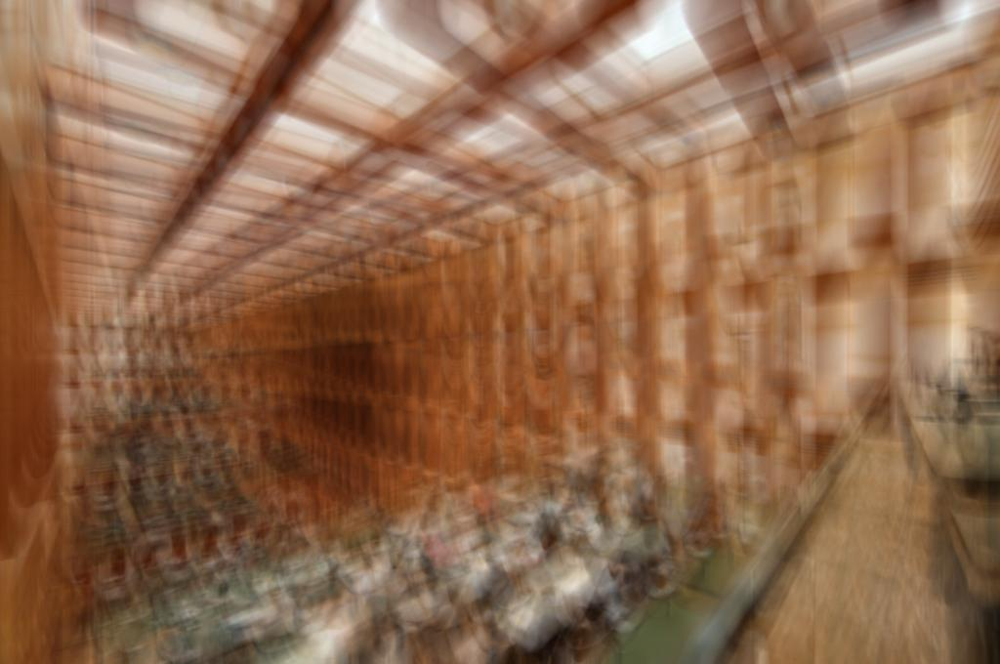
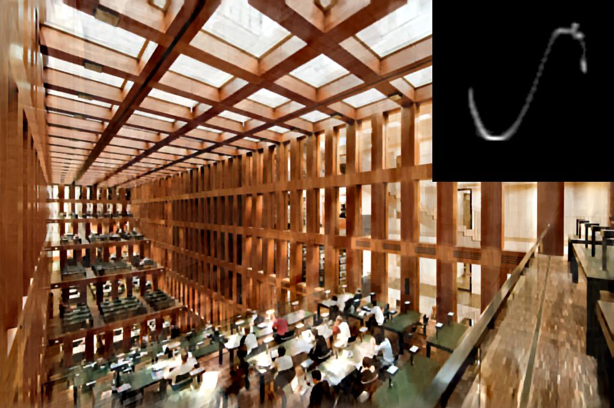
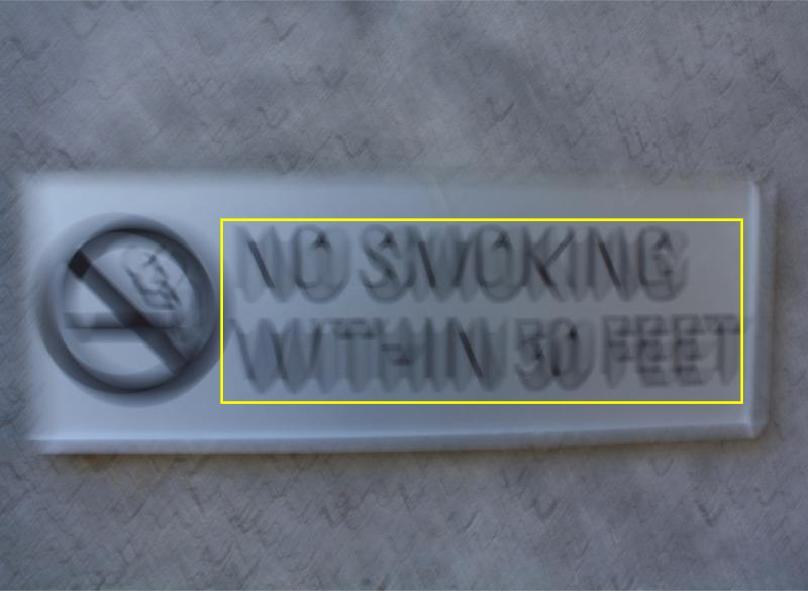
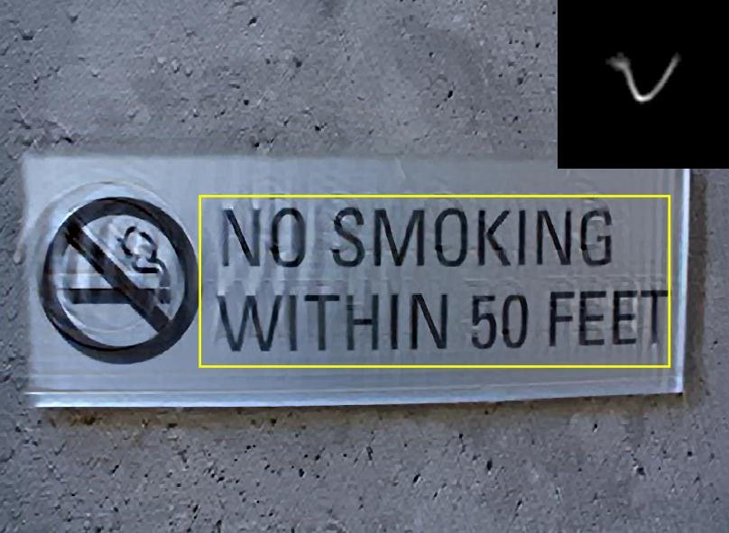

# deblurring.tri-segment
Image Deblurring Using Tri-Segment Intensity Prior, Neurocomputing, 2020

By Hong Zhang, Yujie Wu, Lei Zhang, Zeyu Zhang, Yawei Li.

This repo is an official implementation of ["Image Deblurring Using Tri-Segment Intensity Prior"](https://www.sciencedirect.com/science/article/abs/pii/S0925231220302782?via%3Dihub), accepted by Neurocomputing, 2020. This repository contains a Matlab implementation of our approach.

## Main Results

<figure class="half">
    
    
    
    
</figure>

The code will be available soon.

## Citing
Please cite our paper in your publications if it helps your research:
```
@article{Zhang2020Image,
  title   = {Image Deblurring Using Tri-Segment Intensity Prior},
  author  = {Hong Zhang, Yujie Wu, Lei Zhang, Zeyu Zhang, Yawei Li},
  journal = {Neurocomputing},
  year    = {2020},
}
```

## Contributing to the project
Any pull requests or issues are welcomed.